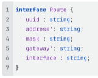

# Тестовое задание

Реализовать таблицу вывода списка маршрутов.

Данные в таблице можно сортировать по любому из столбцов. Сортировка должна работать следующим образом:
- Адрес назначения - через сравнение IP адресов
- Шлюз – через сравнение IP адресов
- Интерфейс – через сравнение строк

Данные
Каждый маршрут представляет собой объект следующего вида:

Сами данные необходимо подготовить - достаточно 8 - 9 маршрутов.

## Технический стек
- Желательно использовать: Angular (>= 18) + Typescript + RxJS
- Можно использовать любые другие библиотеки (на усмотрение разработчика)